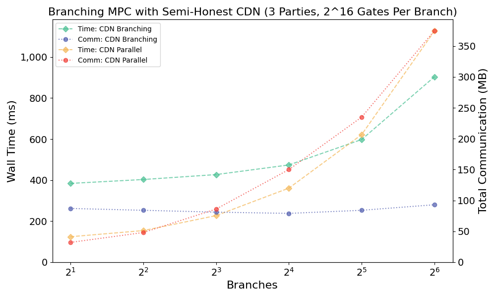
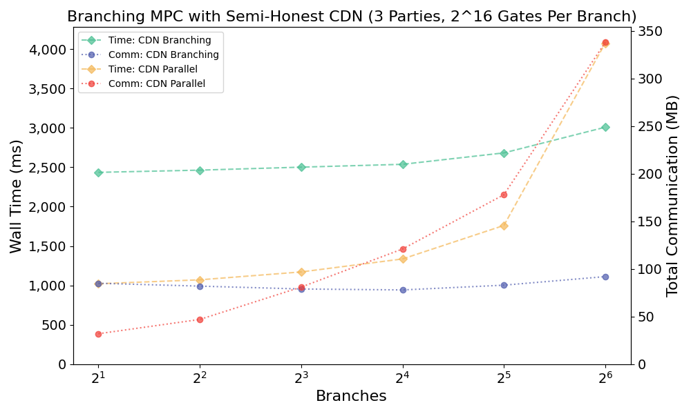
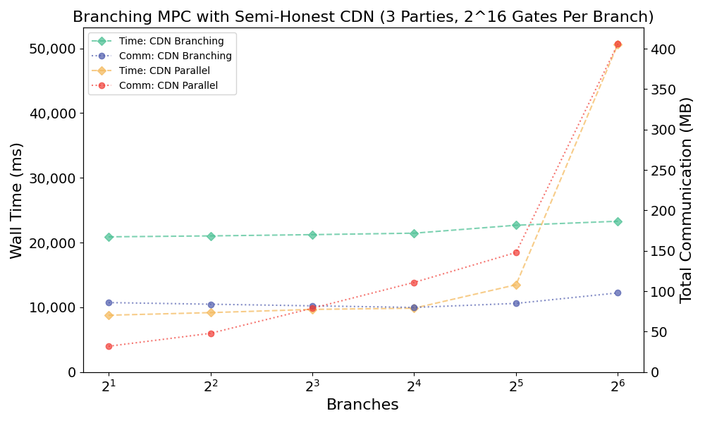
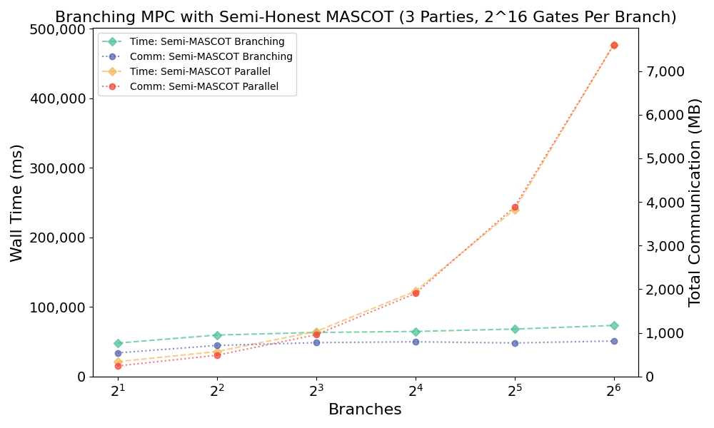

# About

This is a proof-of-concept implementation of the semi-honest version of the "branching MPC" compiler on-top of semi-honest MASCOT (or any other MPC over an arbitrary prime field provided by MP-SPDZ) and CDN respectively for the Eurocrypt 2022 submission
"Communication Efficient Secure Multiparty Computation for Conditional Branches".
CDN is implemented by instantiating the linearly homomorphic encryption using ring LWE.
The implementation is written in a combination of C++ (MP-SPDZ), Go and Python (used for performance non-critical parts).
A copy of MP-SPDZ is included in this directory to ensure the results can be reproduced in future, should the interface change upstream.

Need help comparing your technique with ours? Reach out!

# Warning

Please **DO NOT** use this code in production systems.

The code is provided solely for reproducibility and comparisons in future works.

# Dependencies

## Building / Running

- [make]()
- [python3]() used to compile branching circuits into executable descriptions.
- [pyyaml]() used to parse test descriptions and serialize benchmark results.
- [MP-SPDZ]() for implementations of generic MPC (not used for CDN).
- [Lattigo](https://github.com/ldsec/lattigo) used for implementing the ring LWE components.
- [Go (tested on 1.15 or later)]()

## Benchmarking

For automatic benchmarking (as orchestrated by `runner.py`), we require the following tools / libraries:

- [pwntools](https://docs.pwntools.com/en/stable/) used to interact with processes.
- [tcpdump]() used to calculate the amount of network traffic.
- [Traffic Control (tc)]() used to simulate different network conditions (i.e. latency).

## Plotting

- [matplotlib](https://matplotlib.org/)

In this repository you will also find a Dockerfile which sets up the environment required for benchmarking.

# Reproducing The Results

To compile all benchmarks, run all benchmarks (on the local machine) and create all plots for the final results (found in the paper).

Simply run:

```
make plots
```

## Simulating network delay

Different network delays are simulated by using traffic control to introduce latency over localhost. e.g. for an estimate for WAN with 100ms of latency (200 ms round-trip)

```
sudo tc qdisc add dev lo root handle 1:0 netem delay 100msec

sudo tc qdisc del dev lo root
```

## About memory consumption

Because of the MP-SPDZ circuit compiler consuming massive amount of memory (and time -- it dominates the running time of the benchmark suite),
preparing the benchmarks requires ~ 100GB of RAM if you do not have this available consider temporally allocating a large swap, e.g.

```
sudo fallocate -l 64G tmp-swap
sudo chmod 0600 tmp-swap
sudo mkswap tmp-swap
sudo swapon tmp-swap
```

This should not affect the speed of the benchmark: the actual execution consumes much much less memory than the compiler. Then after benchmarking:

```
sudo swapoff tmp-swap
sudo rm tmp-swap
```

# Results

The benchmarks were produced on a laptop with a `Intel i7-11800H` CPU and `64 GB` of RAM.
See
[/proc/meminfo](https://gist.github.com/rot256/0cafde6c8c99c7ead891a0b1fe0c952d),
[dmidecode --type 17](https://gist.github.com/rot256/8d58f3134a504a602ef2d0bba8436fc5),
[/proc/cpuinfo](https://gist.github.com/rot256/205eefc44178a4c751b95d75e4ab2091) for full details.
The average is taken over 10 executions, the raw data is included in this repository (see `0ms`, `10ms` and `100ms`).

## 0ms Latency (Localhost)

<p align="center">

</p>

<p align="center">

</p>

<p align="center">

</p>

## 10ms Latency (Simulated LAN)

<p align="center">

</p>

<p align="center">

</p>

<p align="center">

</p>

## 100ms Latency (Simulated WAN)

<p align="center">

</p>

<p align="center">

</p>

<p align="center">

</p>

# Resources

Additional relevant resources.

## Software

- [Awesome MPC](https://github.com/rdragos/awesome-mpc/blob/master/readme.md)
- [Lattigo](https://github.com/ldsec/lattigo)
- [MP-SPDZ](https://github.com/data61/MP-SPDZ)

## Papers

- [CDN](https://eprint.iacr.org/2000/055)
- [MASCOT](https://eprint.iacr.org/2016/505)
- [MOTIF](https://eprint.iacr.org/2020/1175.pdf)
