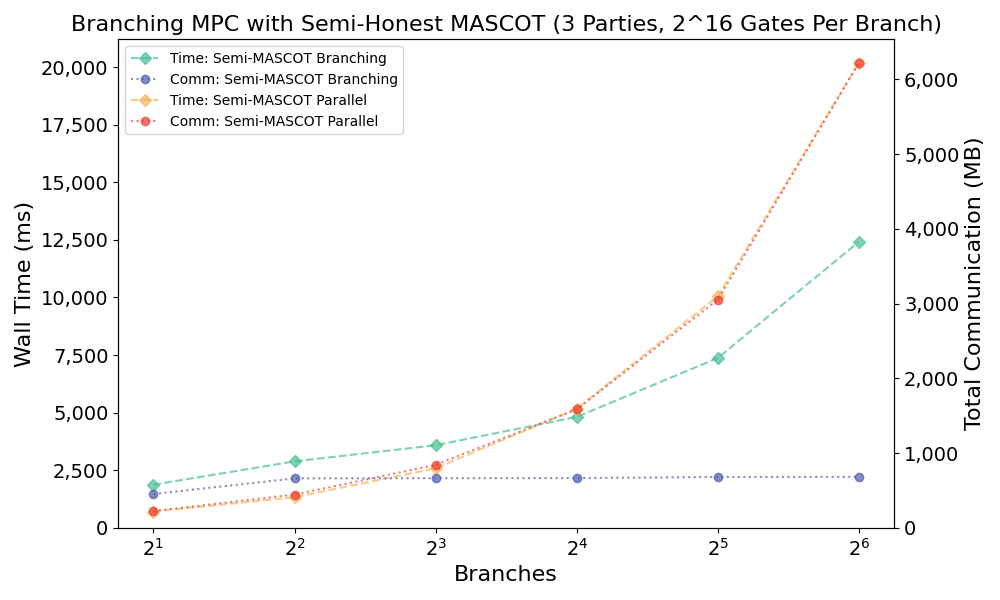
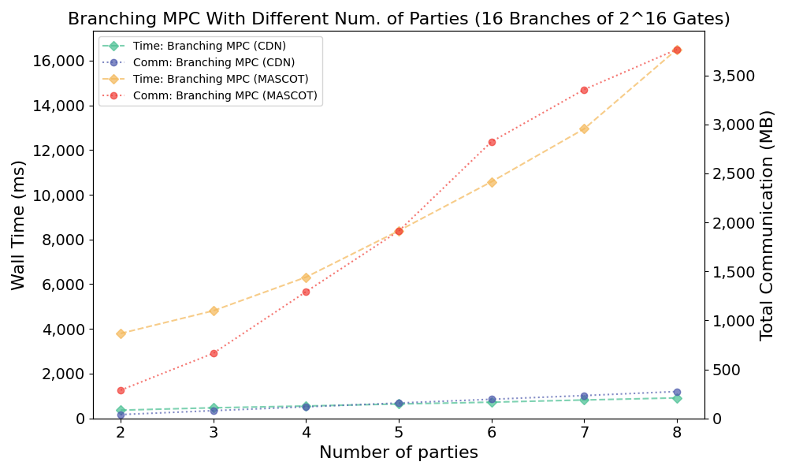

# About

# Results

## 0ms Latency (Localhost)

<p align="center">

</p>

<p align="center">

</p>

<p align="center">

</p>

# Dependencies

## Building / Running

- [make]()
- [python3]() used to compile branching circuits into executable descriptions.
- [pyyaml]() used to parse test descriptions.
- [MP-SPDZ]() for implementations of generic MPC (not used for CDN).
- [Go (1.17 or later)]() implements OIP, the CDN MPC and wraps/interacts with MP-SPDZ.

## Benchmarking

For automatic benchmarking (as orchestrated by `runner.py`), we require the following tools / libraries:

- [pwntools](https://docs.pwntools.com/en/stable/) used to interact with processes.
- [tcpdump]() used to calculate the amount of network traffic.
- [Traffic Control (tc)]() used to simulate different network conditions (i.e. latency).

## Plotting / Data analysis

- [matplotlib]()

# Reproducing The Results

How to reproduce benchmarks.

## Simulating network delay

```
sudo tc qdisc add dev lo root handle 1:0 netem delay 100msec

sudo tc qdisc del dev lo root
```

## About memory consumption

Because of the MP-SPDZ circuit compiler consuming massive amount of memory (and time -- it dominates the running time of the benchmark suite),
preparing the benchmarks requires ~ 100GB of RAM if you do not have this available consider temporally allocating a large swap, e.g.

```
sudo fallocate -l 64G tmp-swap
sudo chmod 0600 tmp-swap
sudo mkswap tmp-swap
sudo swapon tmp-swap
```

This should not affect the speed of the benchmark: the actual execution consumes much much less memory than the compiler. Then after benchmarking:

```
sudo swapon tmp-swap
sudo rm tmp-swap
```

## Producing the plots

To compile all benchmarks, run all benchmarks and create all plots of the final results. Simply run:

```
make plots
```

# Resources

Additional resources:

## Software

- [Awesome MPC](https://github.com/rdragos/awesome-mpc/blob/master/readme.md)
- [Lattigo](https://github.com/ldsec/lattigo)
- [MP-SPDZ](https://github.com/data61/MP-SPDZ)

## Papers

- [CDN](https://eprint.iacr.org/2000/055)
- [MASCOT](https://eprint.iacr.org/2016/505)
